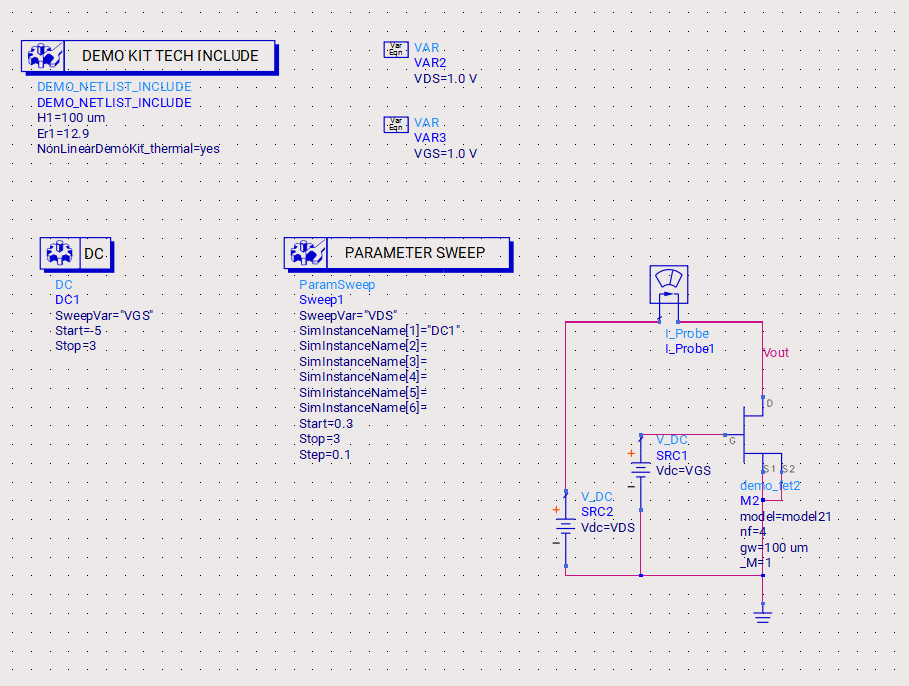

# Active Multiplier

## Introduction
- Using the nonlinearity of the FET for frequency multiplication
- Here I am simulating a compressed class A Active Frequency Multiplier 
- First I am determining the cut off frequency of the Transistor used and then simulating a Active multiplier using a Harmonic Balance Testbench setup

## Simulation Setup
The simulation setup for the Active Multiplier includes the following components:
1. **Schematic Design**
    
2. **Testbenches**:
   - **DC Operation Simulation**: To determine the operating point of the transistor
    
   - **Cutoff Frequency Test**: To determine cutoff frequency of the transistor
    

## Results
The simulation results include:
1. **DC Operation**:
    
    VGS=2V & VDS=2.5V
2. **Cutoff Frequency**:
    
3. **Harmonic Balance**: We can observe a range of frequencies generated at the output
   
