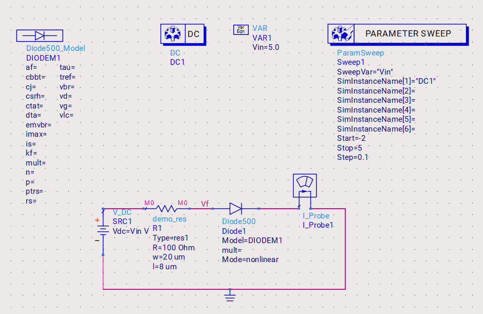

# Diode Multiplier 

## Introduction
- We use the non linearity of the diode for frequency multiplication
- The non linear current response if defined by the equation $I = I_s \left(e^{\frac{qV}{k_B*T}} - 1\right)$.
- Diode Multiplier have a strong dependcy on the operating point  
- In this simulation exercise I am considering two circuits
    - Even order frequency multiplier: Balanced/Push-Pull diode configuration. Most important concept of this circuit is the summation of currents through the diodes
    - Odd order frequency multiplier : Most important concept of this circuit is difference of currents through the diode
- Both of the above circuits have strong dependence on the operating hence I will simualting the DC operating point followed by a harmonic balance simulation for a even order and a odd order frequency multiplier
## Simulation Setup
The simulation setup for the Diode Multiplier includes the following components:
1. **Even Order Frequency Multiplier **
    
2. **Odd Order Frequency Multiplier **
    
2. **DC Operation Simulation**: To determine the forward voltage of the diode
    

## Results
The simulation results include:
1. **DC Operation**:
    
    Vf=0.548V
2. **Harmonic Balance Simulation Even Order**: Here we can observe a strong 2nd and 4th order Harmonics
   
3. **Harmoic Balance Simulation Odd Order**: Here we can observe a strong fundamental and 3rd order Harmonics
    
