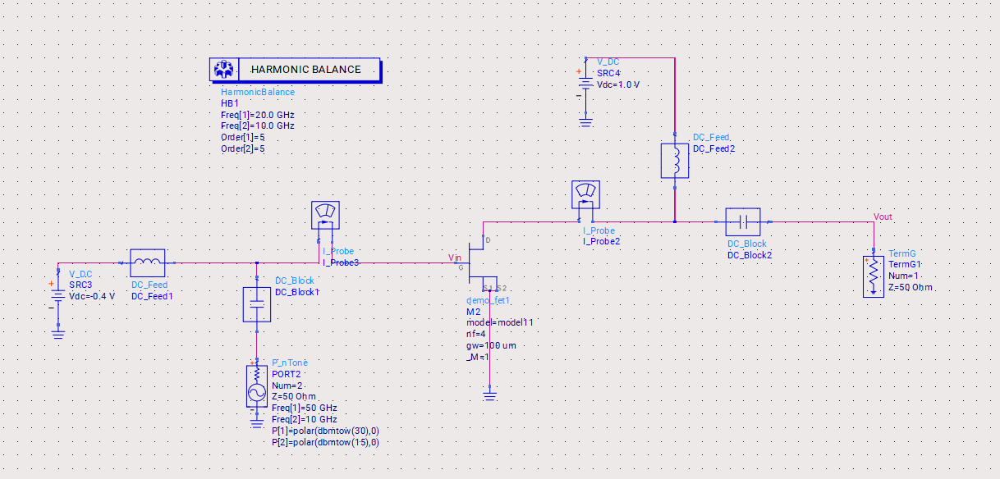

# Upconversion Transconductance Mixer 

## Introduction
- We are using the nonlinear transfer characteristics of the FET to generate mixing products.
- LO and IF are applied to the Gate of the MOSFET. 
- LO power modulates the transconductance of the mixer. LO power makes the transistor to swing between threshold region and sub-threshold region
- In this example I have considered class B operation with LO=50GHz and IF=10GHz 
- RF is the output taken from the Drain of the MOSFET 
## Simulation Setup
The simulation setup for the Transconductance Mixer includes the following components:
1. **Schematic Design**
    
2. **DC Operation Simulation**: To determine class B operation point
    

## Results
The simulation results include:
1. **DC Operation**:
    
    VGS=-0.4V & VDS=1V
2. **Harmonic Balance**: We can observe a range of frequencies generated at the output which are generated due to the sum and difference frequencies of LO and IF 
   
